<!--
  QUAN.OS // README
  Sequence of 12 SVG scenes + real Markdown content.
  All visuals are self-hosted. No JS. No iframes. SVG only.
-->

 

### `quan@neural-core:~$ ./intro --whoami`

 

<!-- 02 WHOAMI -->

 

<!-- QUICK NAVIGATION -->

| [▸ About](#about) | [▸ Engineering DNA](#dna) | [▸ Tech Universe](#stack) | [▸ Projects](#projects) | [▸ Workflow](#workflow) | [▸ Telemetry](#telemetry) | [▸ Skyline](#skyline) | [▸ Mission](#mission) | [▸ Roadmap](#roadmap) | [▸ Connect](#connect) |
|:---:|:---:|:---:|:---:|:---:|:---:|:---:|:---:|:---:|:---:|

 

<!-- 03 ABOUT -->

### `about / engineering dna`

 

 

I am **Hồ Ngọc Quân** — a software-engineering student who builds systems
at the intersection of **algorithms, backend, AI and the modern web**.

I like to read the spec, sketch the data flow, and then write the boring,
careful, well-named code that ships it.

**What I study.** Software engineering at the foundations — algorithms,
data structures, computer systems, databases — with a strong applied
focus on the modern web and AI tooling.

**What I build.** Real products, not demos. Multi-language projects
ranging from low-level C code (e.g. **GPU-Server-Manager**) to
TypeScript apps with real users (e.g. **QEnglish**, **face-attendance**)
to experimental games (**Shadow-Collapse**).

**What I'm exploring.** How AI assistants actually fit into engineering
workflows, how to design backend systems that don't fall over, and how
to keep my fundamentals sharp while moving fast.

 

<!-- 04 TECH UNIVERSE -->

### `tech universe`

 

 

**Verified languages and stacks (drawn from public repositories):**

| Group | Stack |
| --- | --- |
| Languages | TypeScript · JavaScript · C · C++ · HTML |
| Web | React · Next.js · HTML5 |
| Backend | Node.js · MongoDB · PostgreSQL |
| Data | SQL · JSON |
| Tools | Git · GitHub · Linux · Vercel · Cursor |

 

<!-- 05 PROJECTS -->

### `featured systems`

 

↳ Regenerated by <code>scripts/generate_profile_metrics.py</code> in CI using only the GitHub REST API. No fake stars.

 

**Featured projects with real links:**

| Repository | Stack | Concept | Status |
| --- | --- | --- | --- |
| [GPU-Server-Manager](https://github.com/hoquan2007/GPU-Server-Manager) | C | GPU server resource scheduler, low-level systems | Active |
| [QEnglish](https://github.com/hoquan2007/QEnglish) | TypeScript | AI conversation platform for English learners | Active |
| [Shadow-Collapse](https://github.com/hoquan2007/Shadow-Collapse) | TypeScript | Procedural dungeon crawler · tilemap + pathfinding | Active |
| [face-attendance](https://github.com/hoquan2007/face-attendance) | TypeScript | Web-based attendance tracking with face recognition | Active |

Full list:
[face-attendance](https://github.com/hoquan2007/face-attendance) ·
[QITEnglish](https://github.com/hoquan2007/QITEnglish) ·
[QMusic](https://github.com/hoquan2007/QMusic) ·
[QEnglish](https://github.com/hoquan2007/QEnglish) ·
[HQ-English](https://github.com/hoquan2007/HQ-English) ·
[Web-xem-phim](https://github.com/hoquan2007/Web-xem-phim) ·
[SOLO-GAME](https://github.com/hoquan2007/SOLO-GAME) ·
[HQEnglish](https://github.com/hoquan2007/HQEnglish) ·
[EnglishHNQ](https://github.com/hoquan2007/EnglishHNQ) ·
[Shadow-Collapse](https://github.com/hoquan2007/Shadow-Collapse) ·
[GPU-Server-Manager](https://github.com/hoquan2007/GPU-Server-Manager) ·
[ProjectChess](https://github.com/hoquan2007/ProjectChess) ·
[ResearchAI](https://github.com/hoquan2007/ResearchAI) ·
[NEXTGPU-COPY](https://github.com/hoquan2007/NEXTGPU-COPY)

 

<!-- 06 WORKFLOW -->

### `engineering workflow`

 

 

<!-- 07 GITHUB TELEMETRY -->

### `github telemetry · live`

 

 

Recent activity:

 

↳ Generated by <code>.github/workflows/profile-telemetry.yml</code> using only the GitHub REST API. No third-party stats services. No fake numbers. Refreshes daily + on every push to <code>scripts/</code>.

 

<!-- 08 CONTRIBUTION SKYLINE -->

### `contribution skyline`

 

↳ Generated nightly by <code>yoshi389111/github-profile-3d-contrib</code>. If the file above is missing, run the <em>Generate 3D Contribution Graph</em> workflow from the Actions tab.

 

### `contribution network`

<picture>
  <source
    media="(prefers-color-scheme: dark)"
    srcset="https://raw.githubusercontent.com/hoquan2007/hoquan2007/output/github-snake-dark.svg"
  />
  <source
    media="(prefers-color-scheme: light)"
    srcset="https://raw.githubusercontent.com/hoquan2007/hoquan2007/output/github-snake.svg"
  />
  
</picture>

↳ Generated by <code>Platane/snk@v3</code>. Snake lives on the <code>output</code> branch and is re-published daily by the <em>Generate Contribution Snake</em> workflow.

 

<!-- 09 CURRENT MISSION -->

### `current mission`

 

 

<!-- 10 ROADMAP -->

### `learning roadmap`

 

 

### `developer philosophy`

 

> **LEARN. BUILD. BREAK. UNDERSTAND. IMPROVE.**

A short set of rules that keeps the work honest: read first, build small,
intentionally break it, understand what failed, and ship the fix.

 

<!-- 11 CONTACT -->

### `connect`

 

| Channel | Handle |
| --- | --- |
| GitHub | [@hoquan2007](https://github.com/hoquan2007) |
| Repositories | [/?tab=repositories](https://github.com/hoquan2007?tab=repositories) |
| Languages | English · Vietnamese |

↳ Only publicly verifiable contact channels are listed. Additional contact info (email / social) is intentionally omitted — verify via the GitHub profile.

 

 

<!-- 12 FOOTER -->

 

---

This profile is fully self-hosted. Every SVG is committed in this repository.
Telemetry is generated by GitHub Actions using only the official GitHub REST API.
The 3D skyline and contribution snake are generated by trusted third-party
actions (<code>yoshi389111/github-profile-3d-contrib</code>, <code>Platane/snk@v3</code>) and
degrade gracefully if those services are temporarily unavailable.

Built with the QUAN.OS design system · v2.0.0
See <a href="./docs/DESIGN_SYSTEM.md">docs/DESIGN_SYSTEM.md</a> for the design tokens and
<a href="./docs/UX_UI_AUDIT_AFTER.md">docs/UX_UI_AUDIT_AFTER.md</a> for the refactor audit.

