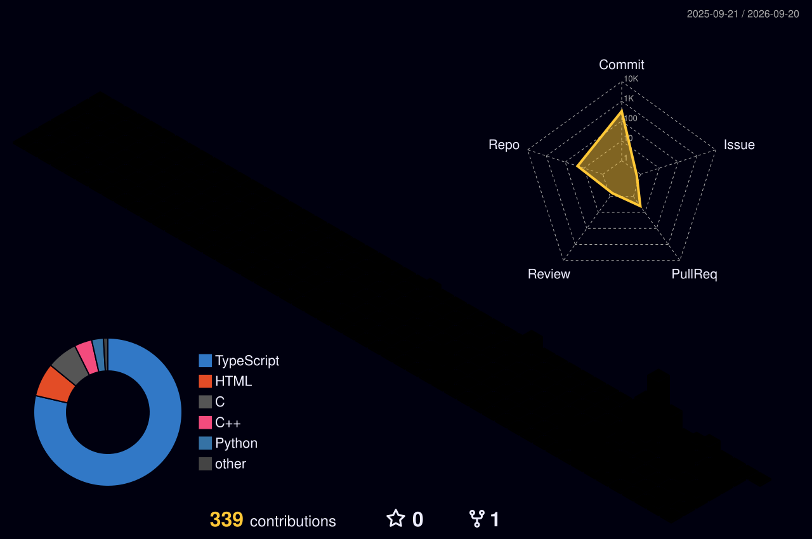
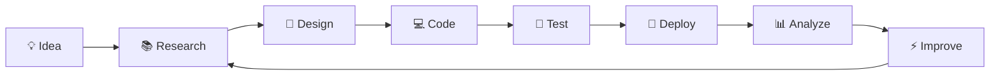

<!-- ========================================================= -->
<!--                    HO NGOC QUAN PROFILE                    -->
<!-- ========================================================= -->

<div align="center">


<br/>


</div>

---

<div align="center">

# 👨‍💻 `whoami`

</div>

```bash
┌──(quan㉿github)-[~/profile]
└─$ whoami

Name        : Hồ Ngọc Quân
Username    : hoquan2007
Role        : Software Engineering Student
Focus       : Artificial Intelligence / Algorithms / Software Engineering
Interests   : AI • Systems • Future Technology • Computer Architecture
Mindset     : Learn → Build → Break → Improve → Repeat
```

<div align="center">

### ⚡ Turning ideas into systems, one commit at a time.

</div>

---

# 🧠 About Me

```typescript
const quan = {
    name: "Hồ Ngọc Quân",

    role: "Software Engineering Student",

    interests: [
        "Artificial Intelligence",
        "Algorithms & Data Structures",
        "Computer Systems",
        "AI Infrastructure",
        "Future Technology"
    ],

    currentlyLearning: [
        "AI Mathematics",
        "Backend Engineering",
        "Database Systems",
        "Modern Web Architecture"
    ],

    languages: [
        "C",
        "C++",
        "TypeScript",
        "JavaScript",
        "Python"
    ],

    philosophy:
        "Code is not only for computers to understand, \
         but also for humans to read, improve and evolve."
};
```

---

<div align="center">

# ⚙️ TECH ARSENAL

### `Languages`


### `Frontend / Backend`


### `Database`


### `Tools / Platform`


<br/><br/>


</div>

---

<div align="center">

# 🚀 FEATURED PROJECT

</div>

<table>
<tr>
<td width="50%">

## 🖥️ NEXTGPU PRO

### AI Data Center Control Panel

A GPU server resource management system written in **C**.

```text
GPU Cluster
    │
    ├── Live Monitoring
    ├── VRAM Management
    ├── Load Balancing
    ├── Server Management
    ├── AI Copilot
    └── Data Persistence
```

**Core concepts**

`C` `Pointers` `Linked Lists` `File I/O`

`Algorithms` `Resource Management`

`Terminal UI` `Systems Programming`

</td>

<td width="50%" align="center">

<a href="https://github.com/hoquan2007/GPU-Server-Manager">
  
</a>

</td>
</tr>
</table>

---

<div align="center">

# 🌌 MY DEVELOPMENT UNIVERSE

```text
                         ┌────────────────────┐
                         │       QUAN         │
                         │   hoquan2007       │
                         └─────────┬──────────┘
                                   │
               ┌───────────────────┼───────────────────┐
               │                   │                   │
               ▼                   ▼                   ▼

       ┌──────────────┐    ┌──────────────┐    ┌──────────────┐
       │      AI      │    │   SOFTWARE   │    │   SYSTEMS    │
       │              │    │ ENGINEERING  │    │              │
       │ Algorithms   │    │ Full Stack   │    │ C / C++      │
       │ Mathematics  │    │ Backend      │    │ Architecture │
       │ Vision       │    │ Databases    │    │ Performance  │
       └──────┬───────┘    └──────┬───────┘    └──────┬───────┘
              │                   │                   │
              └───────────────────┼───────────────────┘
                                  ▼
                       ┌─────────────────────┐
                       │  FUTURE TECHNOLOGY  │
                       └─────────────────────┘
```

</div>

---

<div align="center">

# 📊 GITHUB INTELLIGENCE


<br/>


</div>

---

<div align="center">

# 📈 CONTRIBUTION ACTIVITY


</div>

---

<div align="center">

# 🌃 3D CONTRIBUTION SKYLINE



</div>

---

<div align="center">

# 🐍 CONTRIBUTION SNAKE

<picture>
  <source
    media="(prefers-color-scheme: dark)"
    srcset="https://raw.githubusercontent.com/hoquan2007/hoquan2007/output/github-snake-dark.svg"
  />
  <source
    media="(prefers-color-scheme: light)"
    srcset="https://raw.githubusercontent.com/hoquan2007/hoquan2007/output/github-snake.svg"
  />
  
</picture>

</div>

---

<div align="center">

# 🛰️ CURRENT MISSION

</div>

```text
[ SYSTEM STATUS ]

> Studying Software Engineering........................ [ ONLINE ]
> Exploring Artificial Intelligence................... [ ACTIVE ]
> Mastering Algorithms & Data Structures.............. [ ACTIVE ]
> Learning Backend & Database Engineering.............. [ ACTIVE ]
> Exploring AI Infrastructure.......................... [ ACTIVE ]
> Building ambitious projects.......................... [ ALWAYS ]

SYSTEM MESSAGE:

"Don't just learn technology.
 Build something with it."
```

---

<div align="center">

# 🧬 ENGINEERING MINDSET

</div>



---

<div align="center">

# 📡 CONNECT

<a href="https://github.com/hoquan2007">

</a>

<br/><br/>

```text
┌───────────────────────────────────────────┐
│                                           │
│    "BUILD • LEARN • EXPERIMENT • EVOLVE" │
│                                           │
└───────────────────────────────────────────┘
```

</div>

---

<div align="center">


</div>