<!--
  QUAN.OS // README
  This README is a sequence of 17 animated scenes. All visuals are self-hosted.
  No third-party stats services, no JS, no iframes. SVG only.
-->


 

### <code>quan@neural-core:~$ ./intro --whoami</code>

 

<table align="center" width="100%">
<tr>
<td align="center" width="50%">

I'm **Hồ Ngọc Quân** — a software-engineering student and developer.
I build systems at the intersection of **algorithms, backend, AI and the
modern web**, learning every day through projects that ship.

</td>
<td align="center" width="50%">

Currently focused on: **TypeScript · React/Next.js · Node.js · C · C++**.
Exploring: **databases, systems engineering, and applied AI**.
Open to collaboration on AI · Backend · Algorithms · Web.

</td>
</tr>
</table>

 

<!-- ─────────────── SCENE 02 ─────────────── -->

<!-- ─────────────── SCENE 03 ─────────────── -->

### <code>about / engineering dna</code>

<table align="center" width="100%">
<tr>
<td align="left" width="55%" valign="top">

**Who I am.** A student developer who treats every project as a small
system. I like to read the spec, sketch the data flow, and then write
the boring, careful, well-named code that ships it.

**What I study.** Software engineering at the foundations — algorithms,
data structures, computer systems, databases — with a strong applied
focus on the modern web and AI tooling.

**What I build.** Real products, not demos. Multi-language projects
ranging from low-level C code (e.g. **GPU-Server-Manager**) to
TypeScript apps with real users (e.g. **QEnglish**, **face-attendance**)
to experimental games (**Shadow-Collapse**).

**What I'm exploring.** How AI assistants actually fit into engineering
workflows, how to design backend systems that don't fall over, and how
to keep my fundamentals sharp while moving fast.

</td>
<td align="center" width="45%" valign="top">


</td>
</tr>
</table>

<!-- ─────────────── SCENE 04 ─────────────── -->

 


<!-- ─────────────── SCENE 05 ─────────────── -->

 


<!-- ─────────────── SCENE 06 ─────────────── -->

 

### <code>featured systems</code>


↳ Live version regenerated by <code>scripts/generate_profile_metrics.py</code> in CI.
Static fallback: <a href="./assets/scenes/06-projects.svg">assets/scenes/06-projects.svg</a>.

 

> Quick links: 
> [GPU-Server-Manager](https://github.com/hoquan2007/GPU-Server-Manager) · 
> [QEnglish](https://github.com/hoquan2007/QEnglish) · 
> [Shadow-Collapse](https://github.com/hoquan2007/Shadow-Collapse) · 
> [face-attendance](https://github.com/hoquan2007/face-attendance) · 
> [QITEnglish](https://github.com/hoquan2007/QITEnglish) · 
> [QMusic](https://github.com/hoquan2007/QMusic)

<!-- ─────────────── SCENE 07 ─────────────── -->

 


<!-- ─────────────── SCENE 08 ─────────────── -->

 

### <code>github telemetry · live</code>


↳ Generated by <code>.github/workflows/profile-telemetry.yml</code> using only the GitHub REST API.
No third-party stats services. No fake numbers. Refreshes daily + on every push to <code>scripts/</code>.

<!-- ─────────────── SCENE 09 ─────────────── -->

 

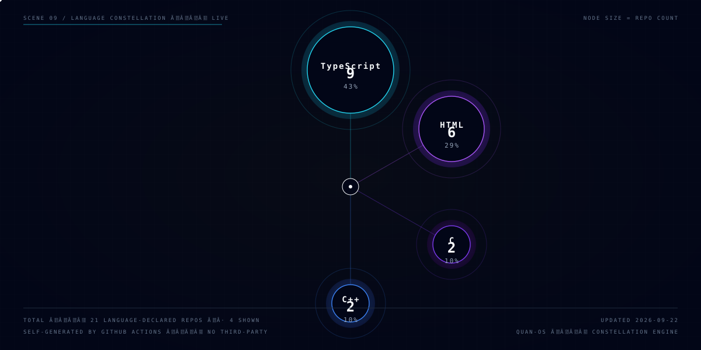

<!-- ─────────────── SCENE 10 ─────────────── -->

 

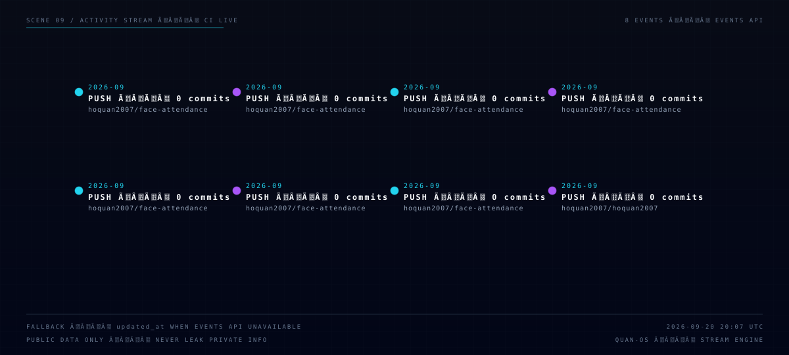

<!-- ─────────────── SCENE 11 ─────────────── -->

 

### <code>contribution skyline · neural city</code>


↳ Generated nightly by <code>yoshi389111/github-profile-3d-contrib</code>.
If the file above is missing, run the <em>Generate 3D Contribution Graph</em> workflow from the Actions tab.

<!-- ─────────────── SCENE 12 ─────────────── -->

 

### <code>contribution network · snake protocol</code>

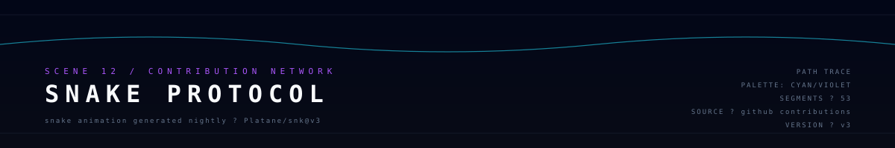

<picture>
  <source
    media="(prefers-color-scheme: dark)"
    srcset="https://raw.githubusercontent.com/hoquan2007/hoquan2007/output/github-snake-dark.svg"
  />
  <source
    media="(prefers-color-scheme: light)"
    srcset="https://raw.githubusercontent.com/hoquan2007/hoquan2007/output/github-snake.svg"
  />
  
</picture>

↳ Generated by <code>Platane/snk@v3</code>. Snake lives on the <code>output</code> branch and is
re-published daily by the <em>Generate Contribution Snake</em> workflow.

<!-- ─────────────── SCENE 13 ─────────────── -->

 

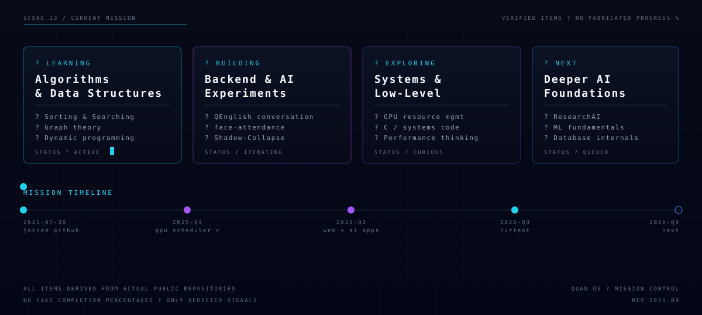

<!-- ─────────────── SCENE 14 ─────────────── -->

 

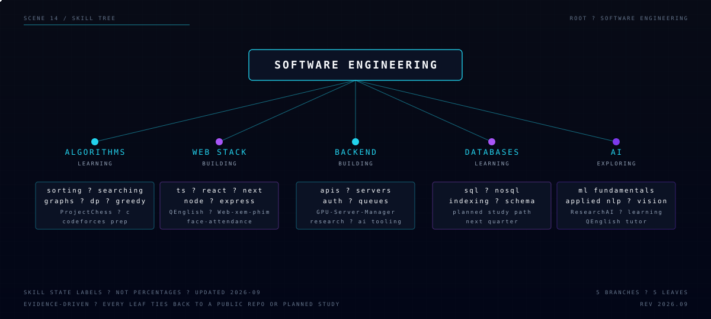

<!-- ─────────────── SCENE 15 ─────────────── -->

 


<!-- ─────────────── SCENE 16 ─────────────── -->

 


 

<table align="center" width="100%">
<tr>
<td align="center" width="33%">

▸ **GitHub**
[`@hoquan2007`](https://github.com/hoquan2007)

</td>
<td align="center" width="33%">

▸ **Repositories**
[`/?tab=repositories`](https://github.com/hoquan2007?tab=repositories)

</td>
<td align="center" width="33%">

▸ **Status**
`UPLINK STABLE · 24/7`

</td>
</tr>
</table>

 

↳ Only publicly verifiable contact channels are listed.
Additional contact info (email / social) is intentionally omitted — verify via the GitHub profile.

<!-- ─────────────── SCENE 17 ─────────────── -->

 

 

---

This profile is fully self-hosted. Every SVG is committed in this repository.
Telemetry is generated by GitHub Actions using only the official GitHub REST API.
The 3D skyline and contribution snake are generated by trusted third-party
actions (<code>yoshi389111/github-profile-3d-contrib</code>, <code>Platane/snk@v3</code>) and
degrade gracefully if those services are temporarily unavailable.

Built with the QUAN.OS design system · v1.0.0
See <a href="./docs/DESIGN_RESEARCH.md">docs/DESIGN_RESEARCH.md</a> for the research behind every scene.

